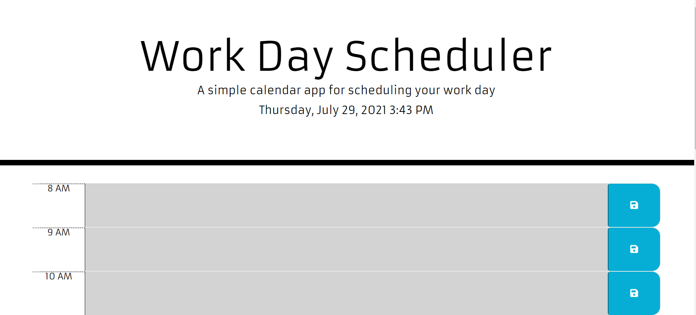

# 05 Third-Party APIs: Work Day Scheduler

## Your Task

This week’s homework required us to build a timed coding quiz with multiple-choice questions. This quiz would run in the browser and will feature dynamically updated HTML and CSS powered by JavaScript code. It will have a clean, polished, and responsive user interface.

Link to deployed application: https://egraham96.github.io/homework-assignment-05/                                                                                              
Link to GitHub Repository: https://github.com/egraham96/homework-assignment-05

