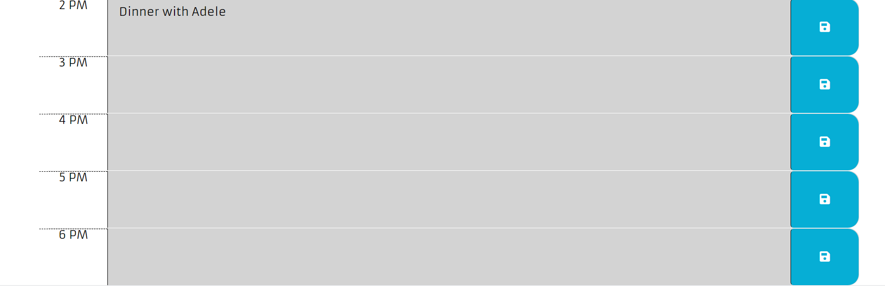

# Homework Assignment 5 - Work Day Scheduler

## Description:
This week's homework required us to create a simple calendar application that allows a user to save events for each hour of the day by modifying starter code. This app runs in the browser and features dynamically updated HTML and CSS powered by jQuery. This application also uses the Moment.js library to work with date and time.

## Built With:
* HTML
* CSS
* Javascript
* [jQuery](https://jquery.com/)
* [jQuery UI](https://jqueryui.com/)
* [Moment JS](https://momentjs.com/)
* [Bootstrap](https://getbootstrap.com/docs/5.1/getting-started/introduction/)
* [Google Fonts](https://developers.google.com/fonts/)

## Deployed Links:
* [See Live Site](https://egraham96.github.io/Workday-Scheduler/)
* [Link to GitHub Repo](https://github.com/egraham96/Workday-Scheduler)

## Preview of Working Site:

## How to Contribute:
If you'd like to contribute to this project please send an email to eeg4@uw.edu or message me on github: egraham96

## License:

